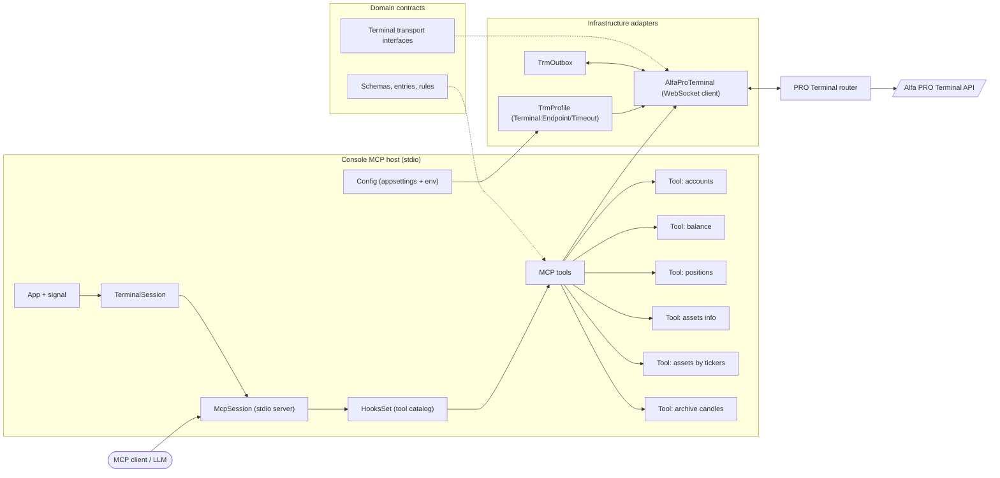

# Architecture Overview

```mermaid
flowchart LR
    client([MCP client / LLM])

    subgraph Host["Console MCP host (stdio)"]
        app["App + signal"]
        session["TerminalSession"]
        mcp["McpSession (stdio server)"]
        catalog["HooksSet (tool catalog)"]
        tools["MCP tools"]
        toolAccounts["Tool: accounts"]
        toolBalance["Tool: balance"]
        toolPositions["Tool: positions"]
        toolAssets["Tool: assets info"]
        toolTickers["Tool: assets by tickers"]
        toolArchive["Tool: archive candles"]
        config["Config (appsettings + env)"]
    end

    subgraph Infrastructure["Infrastructure adapters"]
        terminal["AlfaProTerminal (WebSocket client)"]
        outbox["TrmOutbox"]
        profile["TrmProfile (Terminal:Endpoint/Timeout)"]
    end

    subgraph Domain["Domain contracts"]
        schemas["Schemas, entries, rules"]
        transport["Terminal transport interfaces"]
    end

    router["PRO Terminal router"]
    api[/Alfa PRO Terminal API/]

    client --> mcp
    app --> session
    session --> mcp
    mcp --> catalog
    catalog --> tools
    tools --> toolAccounts
    tools --> toolBalance
    tools --> toolPositions
    tools --> toolAssets
    tools --> toolTickers
    tools --> toolArchive
    tools --> terminal
    config --> profile
    profile --> terminal
    outbox <--> terminal
    schemas -.-> tools
    transport -.-> terminal
    terminal <--> router
    router --> api
```
