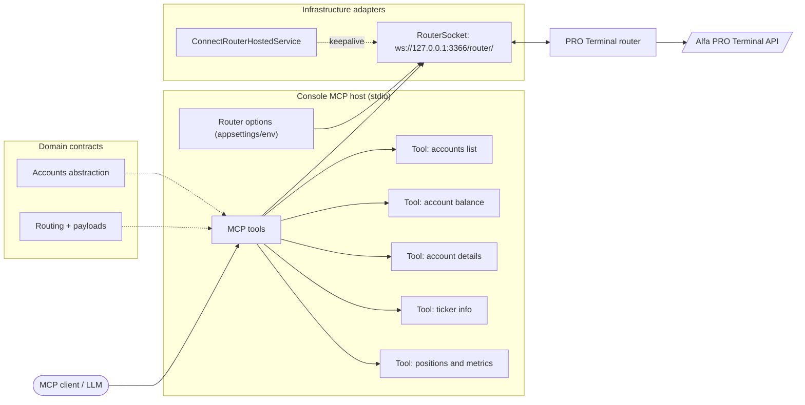

# Architecture Overview

```mermaid
flowchart LR
    client([MCP client / LLM])

    subgraph Host["Console MCP host (stdio)"]
        tools["MCP tools"]
        toolAccounts["Tool: accounts list"]
        toolBalance["Tool: account balance"]
        toolAccountInfo["Tool: account details"]
        toolTicker["Tool: ticker info"]
        toolPortfolio["Tool: positions and metrics"]
        config["Router options (appsettings/env)"]
    end

    subgraph Infrastructure["Infrastructure adapters"]
        socket["RouterSocket: ws://127.0.0.1:3366/router/"]
        service["ConnectRouterHostedService"]
    end

    subgraph Domain["Domain contracts"]
        routing["Routing + payloads"]
        accounts["Accounts abstraction"]
    end

    router["PRO Terminal router"]
    api[/Alfa PRO Terminal API/]

    client --> tools
    tools --> toolAccounts
    tools --> toolBalance
    tools --> toolAccountInfo
    tools --> toolTicker
    tools --> toolPortfolio
    tools --> socket
    config --> socket
    routing -.-> tools
    accounts -.-> tools
    service -. keepalive .-> socket
    socket <--> router
    router --> api
```
